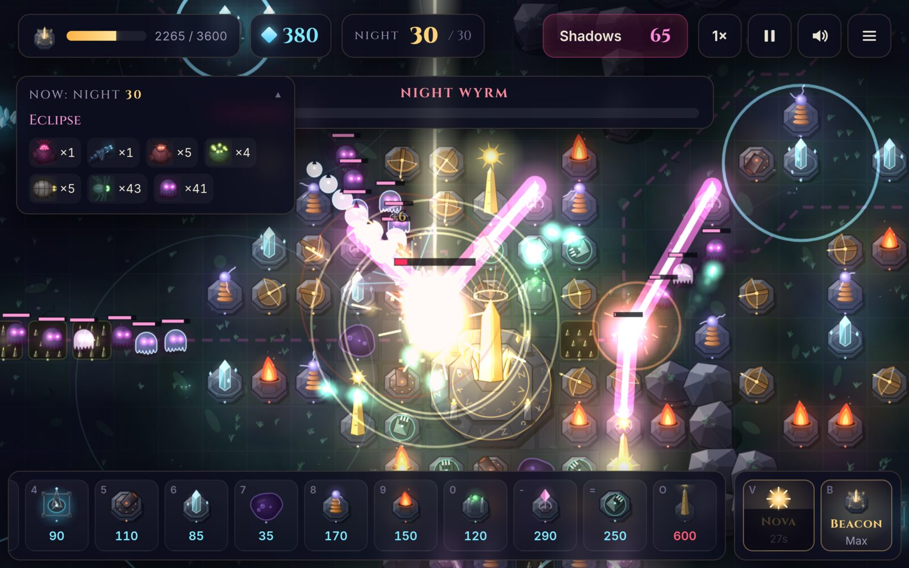
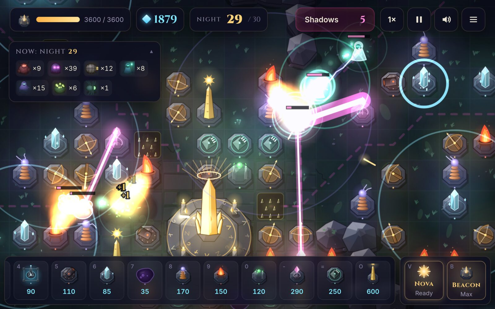
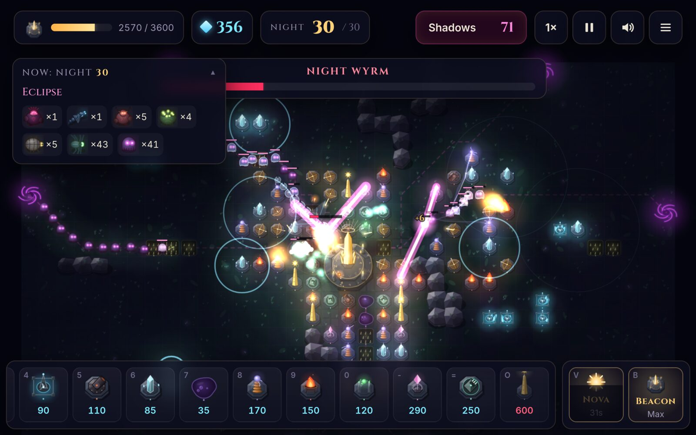
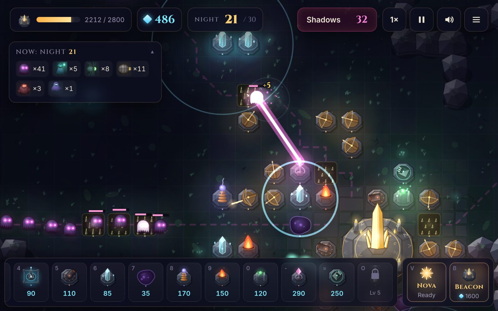
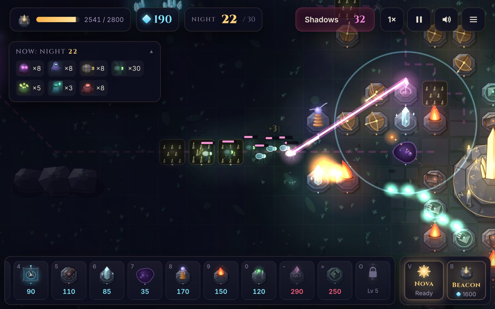
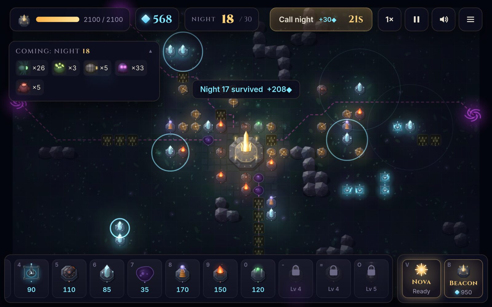
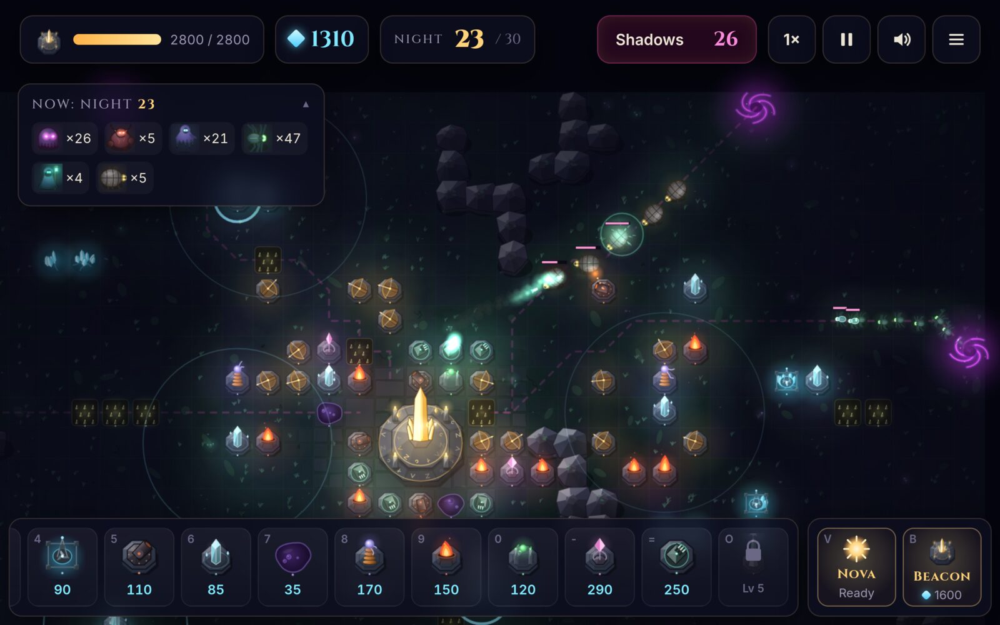
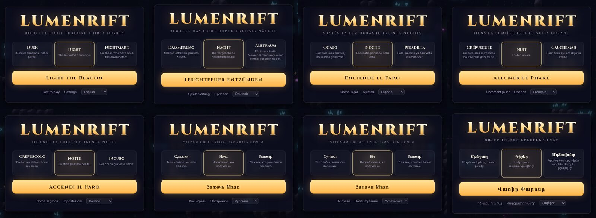
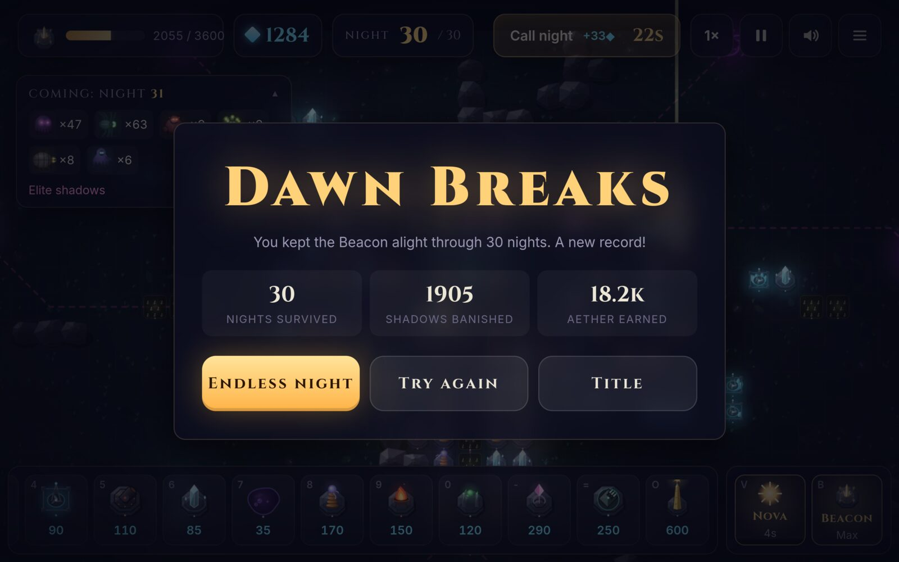

<div align="center">

# ✦ LUMENRIFT ✦

### *Hold the light through thirty nights.*

**A tower defense game where the last light in the world stands against an endless tide of shadow.**

[**▶ Play in your browser — lumenrift.wbg.gg**](https://lumenrift.wbg.gg)



*No engine, no image files, no audio files. Every pixel is drawn in code, and every sound is synthesized live.*

</div>

---

## What is this?

Something has torn the world open. **Rifts** bleed shadows onto the land, and each night more of them crawl toward the one thing they hate: the **Beacon**, the last light, burning in the middle of the map.

You build around it. Walls bend the shadows' path, towers burn them away, crystal harvesters pay for the next line of defence, and every time you **ascend the Beacon** a new tier of weapons opens up. Hold out through thirty nights, including three boss nights and a final **Eclipse**, and the dawn breaks. Or keep going into endless night and see how long the light lasts.

- 🗺️ **Procedural maps.** Every run has a new layout of rocks, crystal veins and rift sites.
- 🧱 **Real mazing.** Shadows follow a live flow field, so every wall you place re-routes them. A glowing trail shows the current path.
- 🏰 **13 structures in 5 tiers, each with 3 upgrade levels.** From cheap walls and spike traps up to chain-lightning coils, ramping prism beams and a Sun Obelisk that calls down pillars of fire.
- 👁️ **9 kinds of shadow.** Swarmers, flyers that ignore your maze, wall-smashing brutes, healers, armoured beetles, egg-sacs that burst into more enemies, and two bosses.
- 🌗 **Dynamic lighting.** The world is dark. Your towers are the light.
- 🎵 **Procedural audio.** Synthesized sound effects and an adaptive generative score that swells when the shadows come.
- 📱 **Desktop and mobile.** Mouse and keyboard, or touch with pinch-zoom.
- 🌍 **5 languages:** English, Deutsch, Español, Français, Русский. The game picks your system language automatically, and you can switch any time.

## Screenshots

<table>
<tr>
<td width="50%"><br><sub><b>Night 29.</b> A fully ascended Beacon, with obelisks, prisms and coils firing at once.</sub></td>
<td width="50%"><br><sub><b>The Eclipse.</b> The Night Wyrm and the Gloom Colossus arrive together on night 30.</sub></td>
</tr>
<tr>
<td><br><sub><b>Prism Lance.</b> The longer it holds a target, the harder it burns.</sub></td>
<td><br><sub><b>The Swarm.</b> Skitters pour over the Thornfields as Skyhunter missiles arc in.</sub></td>
</tr>
<tr>
<td><br><sub><b>Build phase.</b> The pink trails show exactly where the shadows will walk.</sub></td>
<td><br><sub><b>Three rifts, one light.</b> Night 23.</sub></td>
</tr>
<tr>
<td><br><sub><b>Five languages</b>, detected from your system.</sub></td>
<td><br><sub><b>Dawn breaks.</b> Then you can keep going into endless night.</sub></td>
</tr>
</table>

## How to play

1. **Build.** Pick a structure from the bottom bar and place it on the grid. Between nights a countdown gives you time to prepare. Call the night early if you're confident; the seconds you skip are paid out as bonus aether.
2. **Shape the path.** Shadows always take the shortest open route to the Beacon. Walls and towers block it and force a detour, so a long maze keeps them under fire for longer. You can't seal the path completely: the game won't let you.
3. **Read the night ahead.** The panel on the left previews the next night's shadows, warns you when a new rift is about to open, and introduces each new kind of shadow.
4. **Ascend.** Upgrading the Beacon gives it more health, a stronger gun and Nova, and unlocks the next tier of structures.
5. **Nova.** When shadows reach the light, unleash the Beacon's Nova: a burst of sunfire around the Beacon that damages and slows everything nearby.

### Structures

| Tier | Structure | What it does |
|:---:|---|---|
| 1 | **Bulwark** | Cheap wall. The heart of every maze. |
| 1 | **Arbalest** | Fast bolts that hit ground and air. The reliable all-rounder. |
| 1 | **Thornfield** | Spike trap that shadows walk over. Pierces armour. |
| 1 | **Harvester** | Economy. Must sit on a crystal vein, and pays out every night you survive. |
| 2 | **Ember Mortar** | Long-range explosive shells that hit ground shadows only. |
| 2 | **Frost Pylon** | Slowing aura that reaches flyers too. |
| 2 | **Tar Mire** | Sticky pool that heavily slows ground shadows. |
| 3 | **Tesla Coil** | Chain lightning that jumps between several shadows. Excellent against swarms. |
| 3 | **Pyre** | Flame cone that sets shadows burning. |
| 3 | **Mender Shrine** | Repairs nearby structures and, more slowly, the Beacon. |
| 4 | **Prism Lance** | Beam whose damage keeps rising the longer it holds one target. Kills bosses. |
| 4 | **Skyhunter** | Homing missile battery that targets flyers first. |
| 5 | **Sun Obelisk** | Calls down a pillar of sunfire on the strongest shadow in a huge radius. |

### The shadows

| | Shadow | |
|---|---|---|
| 👻 | **Shade** | The rank and file. |
| 🕷️ | **Skitter** | Fast, fragile, and comes in swarms. |
| 🦇 | **Wraith** | Flies. Ignores your maze. |
| 🐗 | **Brute** | Armoured. Smashes through walls rather than walking around them. |
| 🥚 | **Broodmother** | Bursts into skitters when killed. |
| 🏮 | **Hollow Warden** | Heals the shadows around it. Kill it first. |
| 🪲 | **Carapace** | Heavy plating blunts weak hits. |
| 👑 | **Gloom Colossus** | Boss. Crushes walls and sheds shades as it walks. |
| 🐉 | **Night Wyrm** | Flying boss that sheds wraiths from its coils. |

### Controls

| | Desktop | Touch |
|---|---|---|
| Build | <kbd>1</kbd>…<kbd>=</kbd> or click the bar, then click a tile (drag to paint walls and traps) | Tap the bar, tap a tile, tap it again to confirm |
| Select | Click a structure or the Beacon | Tap |
| Upgrade / sell / targeting | <kbd>U</kbd> / <kbd>X</kbd> / <kbd>T</kbd> | Buttons in the panel |
| Nova / Beacon | <kbd>V</kbd> / <kbd>B</kbd> | Buttons at bottom right |
| Call night · pause · speed · mute | <kbd>N</kbd> · <kbd>Space</kbd> · <kbd>F</kbd> · <kbd>M</kbd> | Buttons at the top |
| Camera | Wheel to zoom, right- or middle-drag to pan | Pinch and drag |

---

## How it was made

LUMENRIFT was designed, written, drawn, composed and balanced by **Claude** (Anthropic's model, running in Claude Code), working autonomously from a single prompt. Everything is TypeScript on a bare Canvas2D, bundled with Vite. There are no game engines and no runtime dependencies.

### The original prompt

This is the entire brief the game was built from, quoted verbatim:

> Make a tower defense game (playable in web, I'll give you the github repo to commit to later, for now you can init a normal git repo). Basically a single game always starts with some kind of central building in the middle, and as you progress, you can buy more advanced stuff. You're attacked by some kind of enemies, that grow in numbers over the time (should be well-balanced to keep it interesting). And you keep defending by installing different kinds of weapons, traps, walls, whatever. I'll leave up to you not only the programming part, but also the creative part and the assets part - so you gotta stay creative. You can create commits, and you can also spawn agents to help you. You can also test it if you can. If you have some questions it's time to ask them now, afterwards you'll be working on your own

Claude asked four quick questions. The answers were: TypeScript + Vite with no engine; art style and map layout left up to Claude; sound and mobile support in scope. After that it worked on its own: the name, the setting, every structure and shadow, the art, the music and the balance were all its choices. The only later requests were renaming the game (it started life as *LUMEN*), adding the five languages, and this README.

### Architecture

```
src/
  game/      the simulation: pure logic, no DOM (≈2.4k lines)
  render/    camera, lighting, particles, procedural sprites (≈4.1k)
  audio/     WebAudio synthesizer and generative music (≈1k)
  ui/        DOM HUD, panels, screens, mouse/touch/keyboard input (≈1.1k)
  i18n/      5 languages
scripts/     headless balance simulator, browser smoke tests
```

### The simulation

The game logic in `src/game` knows nothing about the screen. It runs at a **fixed 60 Hz timestep**, so 1×, 2× and 3× speed behave identically, and it talks to the outside world through a queue of events (`shoot`, `explode`, `die`, `coreHit`, …). The renderer turns those events into particles and flashes, the audio engine into sound, and the UI into toasts. Because of that split, the whole game can run headless in Node, which is what made balancing possible (see below).

**Pathfinding: flow fields.** Instead of computing a path for each enemy, the game runs one Dijkstra search *outward from the Beacon* over the 37×23 grid. Every tile then knows its distance to the light, and each shadow simply steps to whichever neighbouring tile is closer. It's cheap enough to recompute on every placement. There are actually two fields:
- **Ground field:** walls and towers are impassable.
- **Breaker field:** buildings are passable but cost extra, in proportion to their remaining health. Brutes and the Colossus follow this one, so they walk around your maze when the detour is short and punch through it when it's long.

**Placement rules.** Before a blocking structure is placed, the game recomputes the field with that tile blocked. If any rift, including rifts that haven't opened yet, would lose its route to the Beacon, the placement is refused. That's what makes the mazing fair: you can make the path as long as you like, but never seal it.

**Movement.** Enemies steer toward the centre of their next tile, plus a small random offset per enemy so crowds don't march in single file. Diagonal steps are only allowed when both orthogonal neighbours are open, so enemies can't cut corners through walls. Flyers ignore the grid entirely and head straight for the Beacon.

**Combat.**
- **Armour** is a flat reduction per hit, with a floor of 25% of the hit's damage. Many weak hits struggle against Carapaces while heavy shells sail through, and spike traps and sunfire pierce armour.
- **Continuous damage** (flames, beams, auras) uses a percentage reduction instead, so it isn't wiped out by flat armour.
- **Targeting:** towers pick targets by *first* (closest to the Beacon along the path), *last*, *strongest* or *closest*.
- **Prism beams** ramp from 1× to 4× damage over three seconds on the same target.
- **Tesla arcs** jump to the nearest un-hit enemy, losing 15% damage per jump.
- **The Obelisk** marks its target, tracks it for 0.85 s, then strikes.

**Leaks.** Ordinary shadows that reach the Beacon dive into it and burn out, dealing a one-time chunk of damage, so Beacon health works like lives. Bosses stay and pound on it. An early prototype let every enemy attack continuously, which made one bad leak an instant loss, so that was changed.

### Waves

Each night gets a **threat budget** of `5 + 2.6·n + 0.15·n²`. Each enemy type has a threat cost (a shade costs 1, a brute 5), and the wave generator spends the budget on groups picked by weighted randomness from the types unlocked so far. The whole thing is seeded, so the same night always contains the same shadows.

- **Structure:**
  - Every 5th night is themed: *Wings in the Dark* (flyers), *The Swarm* or *Siege*.
  - Every 10th night brings a boss.
  - Night 30, the *Eclipse*, sends both bosses together.
- **New shadow types** are introduced gradually, with a guaranteed group on the night each first appears.
- **Enemy health** follows `1 + 0.06w + 0.0095w² + 0.0013·max(0, w−8)³`: gentle early on, then steep enough that endless mode eventually overwhelms everyone.
- **Elite condensation:** very large late waves are condensed into fewer, tougher elite shadows so the screen stays readable and the frame rate stays high.
- **Rifts** open on nights 1, 4, 9, 15, 22 and 28. They're announced one night ahead as a flickering tear in the ground, with their future path already traced.

### Balancing with robots

Balance wasn't guessed; it was simulated. `scripts/sim.ts` plays hundreds of complete games headlessly with a heuristic **bot**. The bot places towers where they cover the most path, upgrades its best damage dealers, builds harvesters, ascends the Beacon on schedule, uses the Nova, and optionally mazes with wall segments. It reports how far it survives. A full 30-night game simulates in a fraction of a second.

The first sims were humbling:
- **Nobody survived night 5,** because enemy health scaled faster than income.
- **Economy snowball.** After retuning, survivors rolled all the way to night 60+: bounties scaled with the night number, so income outgrew the threat and the map filled with towers.
- **The first boss was a wall.** On short-path maps it walked up to the Beacon almost untouched. It also kept summoning minions while standing next to the Beacon, and they leaked instantly.

Each fix was checked by re-running the sims across seeds and difficulties until the curve looked right. On *Night* difficulty, a decent bot playing without mazing now spreads from about night 10 to night 42, with a median around night 30. The boss nights act as spikes, and roughly a third of runs see the dawn. *Dusk* is comfortably winnable, and *Nightmare* stops the bot around night 12. A human who mazes well does better than the bot.

### Art: everything is code

There isn't a single image file in the game. Every sprite is drawn with Canvas2D paths in `src/render/sprites/`:
- **Terrain:** the ground is rendered once per zoom level into an offscreen canvas: mossy earth, flagstones, grass tufts, pebbles and cracks, all placed from a per-tile noise value. Boulders are faceted low-poly polygons.
- **Structures and the Beacon:** every structure has a stone plinth, a silhouette that changes with its level, and glowing pips. The Beacon is a golden crystal spire on a runed dais that grows more ornate as it ascends.
- **Enemies** are inky silhouettes with glowing eyes, animated from time plus a per-enemy phase: wobbling shades, spiders with walking legs, a segmented Wyrm whose body trails its head. Hits flash white, slowed enemies get a frost rim, burning ones shed embers, and elites get a crimson aura.
- **Caching:** static parts (plinths, walls keyed by their neighbour mask, the Beacon's base) are cached per zoom level, so hundreds of sprites stay cheap.

**Lighting** is the heart of the look. Each frame, a half-resolution light map is filled with night-blue darkness. Every light source punches a soft hole in it with `destination-out`: the Beacon, towers, crystals, rifts, projectiles, explosions, and a faint halo around each shadow so silhouettes still read in the dark. That map is laid over the world. Then a second pass with `lighter` (additive) blending draws coloured glows, beams, lightning, glowing eyes and particles *on top* of the darkness, so light sources bloom out of the night. The darkness also deepens when a night begins and lifts slightly between nights.

**Effects** come from a small particle system (sparks, embers, smoke, shockwave rings, shards, floating numbers), jagged chain lightning re-randomized every frame, beams whose width grows with their charge, mortar shells on a parabolic arc with ground shadows, screen shake, and a red vignette when the Beacon is hurt.

### Sound: a synthesizer in the browser

`src/audio/audio.ts` is a small synthesizer built on WebAudio. There are no samples: every sound is oscillators, filtered noise and envelopes. The crossbow twang is a pitch-dropping plucked tone, explosions are a sub-bass thump plus a noise burst, tesla is crackling ring-modulated noise, and the obelisk is a rising charge followed by a boom. Each sound is rate-limited and voice-capped so fifty towers firing at once never crackle, and everything passes through a compressor and a limiter.

The **music is generative**: a lookahead scheduler plays pads, arpeggios, bass and percussion over a slow minor-key progression. Build phases are calm; nights add a pulsing bass and drums whose density follows how many shadows are on the field; boss nights turn darker and more urgent; and victory resolves into a major key.

### UI, languages and testing

- **HUD:** the interface is plain DOM over the canvas, glass panels with Cinzel headings, and it diff-updates only what changed each frame. The layout adapts to phones in both portrait and landscape.
- **Languages:** all text lives in `src/i18n`. The game detects your system language and falls back to English, and switching language in Settings rebuilds the UI instantly without interrupting a run.
- **Browser testing:** the game was played in headless Chromium through Playwright scripts. They cover the title screen, placing and painting walls, touch taps, pinch-free layouts on phone viewports, full runs to victory and to defeat, and frame timing under late-game load, all with zero console errors.

### Built by a team of agents

The main agent designed the game, wrote the simulation, renderer, UI and balance tooling, and coordinated the rest. Parts of the work were delegated to parallel sub-agents:
- one composed the **audio engine**;
- one drew the **entire sprite set** and iterated on it by screenshotting its own test scenes;
- a fresh-eyed **reviewer** hunted bugs. It found eight, including a softlock where walling off a rift before it opened blocked all building, and all eight were fixed;
- four **translators** handled German, Spanish, French and Russian at the same time.

---

## Development

```bash
npm install
npm run dev        # http://localhost:5173
npm run build      # type-check + production build into dist/
npm run sim -- 16 normal 0 0.7     # balance sim: runs, difficulty, bot mazing (0/1), bot skill
```

Debug URL parameters: `?autostart=normal&seed=123&ff=300&bot=1` starts a game directly, fast-forwards 300 seconds with the bot playing, and leaves the bot in control.

Browser smoke tests (needs a running dev server and a Chromium binary):

```bash
CHROMIUM=$(which chromium) node scripts/shot.mjs http://localhost:5173/
CHROMIUM=$(which chromium) node scripts/flow.mjs http://localhost:5173/
```

Every push to `main` is built and deployed to GitHub Pages by `.github/workflows/deploy.yml`.
